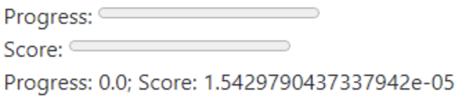

# SimpleWebIDE

For text-based languages, the easiest way to test feedback is to use SimpleWebIDE. It emulated a web-based IDE. This IDE cannot run code (yet), and just monitors events to sent to the SimpleAIF service.

## Setup

To set up the development environment:
1. Install [node.js](https://nodejs.org/en)
2. Run the following in the project directory. This will install dependencies.
```bash
npm install
```
3. Install a web host (e.g. XAMPP) or the VSCode Live Server extension.

## Usage

To run the code:
1. Ensure the ``src/config.ts`` file is up to date:
    - It should include the problem IDs you want to test.
    - The baseURL for the endpoint is configured for your hint server (e.g. localhost:5000).
2. Run
```bash
npm run dev
```
3. Make sure your web server is running and serving the dist directory (this is where the build ts → js files will go).
Go to ``index.html``, which will redirect you to ``dist/``.
Type in your problem number, and start typing code.
If everything was set up properly, you should see something at the bottom like this:

If not, you may need to debug by looking at the network requests and logs from the SimpleAIF server.